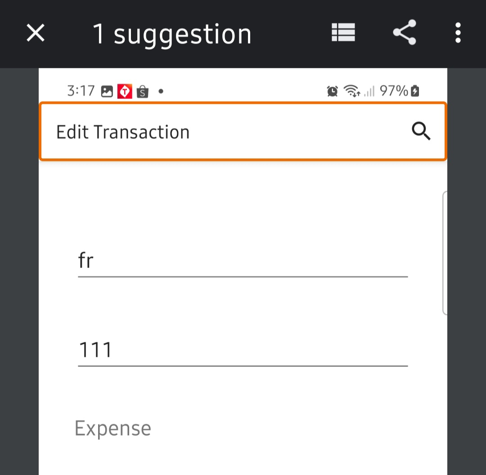

# MBH Transaction Management Android App
Tugas Besar 1 IF3210 Platform-based Application Development
 

## Table of Contents
* [General Info](#general-information)
* [Tampilan Program](#tampilan-program)
* [Library](#library)
* [Pembagian Tugas](#pembagian-tugas)
* [Jam Pengerjaan](#jam-pengerjaan)
* [Bonus Accessibility](#bonus-accessibility)
* [Credits](#credits)
* [Bukti Pengerjaan](#bukti-pengerjaan)

## General Information
MBH adalah sebuah aplikasi manajemen transaksi yang dapat digunakan pada platform Android. Di awal, pengguna perlu melakukan login terlebih dahulu. Setelah itu, pengguna dapat menggunakan fitur manajemen transaksi. Transaksi-transaksi ini nantinya dapat disimpan sebagai file .xlsx atau .xls pada bagian settings. Selain itu, disediakan juga fitur scan transaksi. Lalu, pengguna juga dapat melihat graph dari transaksi-transaksi yang dimiliki. Selanjutnya, pengguna juga dapat menggunakan fitur twibbon sebagai sarana hiburan. Terakhir, jika sudah selesai menggunakan aplikasi, pengguna dapat pindah ke bagian settings dan menekan tombol logout.

## Tampilan Program
* Login
> 
* Add Transaction
> 
* Edit Transaction
> 
* Scan Transaction
> 
* Graph
> 
* Twibbon
> 
* Settings
> 

## Library
- Any Chart View
- Google Map Intent
- Randomize menggunakan Intent
- RecyclerView
- POI
- CameraX
- Room
- Retrofit
- MultiDex
- GSON

## Pembagian Tugas
* Melvin Kent Jonathan
- Melakukan Penambahan, Pengubahan, dan Penghapusan Transaksi
- Melihat Daftar Transaksi yang Sudah Dilakukan
- Membuka Google Maps menggunakan intent
- Melihat Graf Rangkuman Transaksi - Halaman Graf
- Broadcast Receiver - Randomize Transaksi dari Pengaturan
- Melakukan styling

* Bill Clinton            : 
- Mengimplementasikan halaman login
- Mengimplementasikan logout
- Menyimpan Daftar Transaksi dalam Format .xlsx, .xls
- Mengimplementasikan network sensing
- Mengimplementasikan background service (mengecek expiry JWT)
- Mengimplementasikan bonus 1 (Twibbon)
- Mengimplementasikan bonus 3 (Accessibility Testing)
- Melakukan styling

* Hobert Anthony Jonatan  : 
- Header dan Navbar
- Melakukan Scan Nota
- Menyimpan Daftar Transaksi dalam Format .xlsx, .xls
- Intent Gmail untuk mengirim file daftar transaksi
- Melakukan styling

## Jam Pengerjaan
* Melvin Kent Jonathan    : 80 jam
* Bill Clinton            : 80 jam
* Hobert Anthony Jonatan  : 50 jam

## Bonus Accessibility
* Login
> 
Yang dilakukan adalah dengan membuat agar touch area untuk komponen yang bisa ditekan menjadi minimal 48dp dengan minHeight dan mengganti warna agar kontras antara background dan tulisan.
> 
* Add Transaction
> 
Yang dilakukan adalah dengan membuat agar touch area untuk komponen yang bisa ditekan menjadi minimal 48dp dengan minHeight dan mengganti keterangan agar tidak duplikat.
> 
* Edit Transaction
> 
Yang dilakukan adalah dengan membuat agar touch area untuk komponen yang bisa ditekan menjadi minimal 48dp dengan minHeight dan mengganti keterangan agar tidak duplikat.
> 
* Scan Transaction
> 
Yang dilakukan adalah mengganti keterangan agar tidak duplikat dan memberikan content description untuk setiap image button.
> 
* Graph
> 
Yang dilakukan adalah mengganti keterangan agar tidak duplikat.
> 
* Twibbon
> 
Yang dilakukan adalah mengganti keterangan agar tidak duplikat dan memberikan content description untuk setiap image button.
> 
* Settings
> 
Yang dilakukan adalah mengganti keterangan agar tidak duplikat.
> 

## Credits
This project is implemented by:
1. Melvin Kent Jonathan (13521052)
2. Bill Clinton (13521064)
3. Hobert Anthony Jonatan (13521079)

## Bukti Pengerjaan
https://github.com/melvinkj/IF3210-2024-Android-MBH